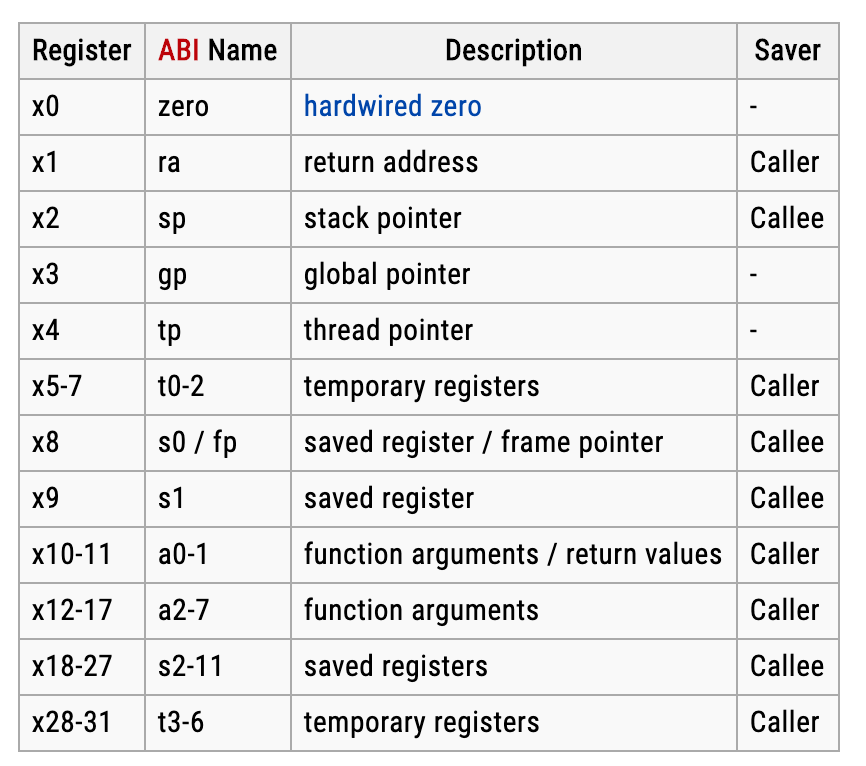

# Verify Ibex Pedagogically (VIP)

#### Testing the Ibex core in a didactic world.

###### Figure 1

Ibex is a 2-stage in-order 32b RISC-V processor core. Ibex has been designed to be small and efficient. ​Figure 1 shows a block diagram of the core. Via two parameters, the core is configurable to support four ISA configurations:

1. RV32E [bit] Embedded mode on or off (16 integer registers only)
2. RV32M [bit] Mult/Div on or off

We ignore two of these configurations (register RV32E). We start with RV32M off and use the last configuration (RV32M on) as a stretch goal. We will most likely ignore Physical Memory Protection (PMP) unless we find ourselves with completed stretch goals.

## Documentation

Much of the documentation makes reference to the RISC-V <a href="riscv-spec-20191213.pdf">Base ISA Unprivileged spec</a>. You can also view this online here: https://github.com/riscv/riscv-isa-manual/releases/tag/Ratified-IMAFDQC

You will also see references to the RISC-V registers which can be summarized thusly:

